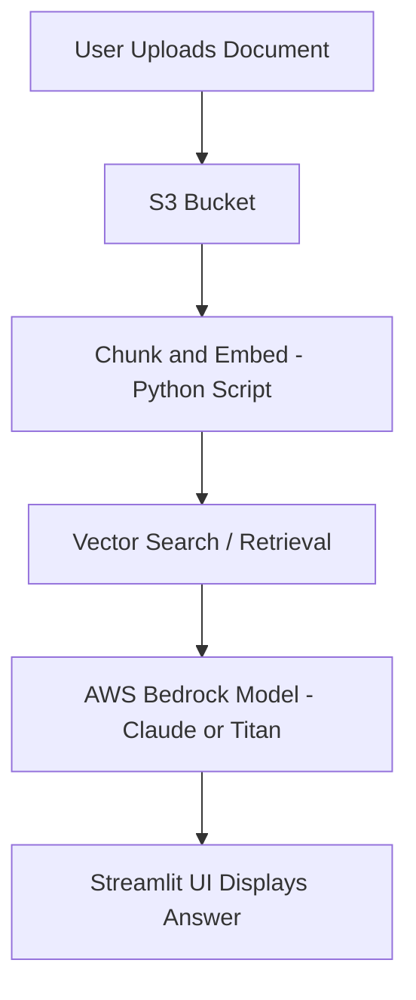

# AskMyDocuments

AskMyDocuments is a small project that demonstrates a mini-RAG (Retrieval-Augmented Generation) system using AWS Bedrock, Amazon S3, and Python. It allows users to ask questions about their documents stored in S3 and receive intelligent answers powered by Bedrock foundation models.

## Features
- Upload and manage documents in Amazon S3
- Embed and retrieve document chunks using vector search
- Generate answers using AWS Bedrock models
- Simple and extensible Python3 codebase
- GitHub Codespaces compatible

## Technologies Used
- Python3
- AWS Bedrock
- Amazon S3
- GitHub & GitHub Codespaces

## Setup Instructions
1. Clone the repository:
   ```bash
   git clone https://github.com/yourusername/AskMyDocuments.git
   ```
2. Open in GitHub Codespaces or your local IDE.
3. Configure .env file. 
4. Install dependencies:
   ```bash
   pip install -r requirements.txt
   ```
5. Configure system packages:
``` bash
   sudo apt update && sudo apt install tesseract-ocr -y
   ```
6. Configure AWS credentials using environment variables or IAM roles (Production Enviroments).
   
## Usage
- Upload documents to your configured S3 bucket.
- Edit .env.example (change name to .env, add bucket name, AWS access and secret access keys)
- Run the ingestion script to chunk and embed documents
  ```bash
  python3 s3_ingest_and_chunk.py && python3 generate_embeddings.py
  ```
- Launch the web-based UI:
  ```bash
  python3 -m streamlit run streamlit_app.py
  ```
- Ask questions via web interface.
- View answers generated using the Bedrock model.

## How It Works

**AskMyDocuments** uses a lightweight Retrieval-Augmented Generation (RAG) pipeline built with AWS Bedrock and Amazon S3.

### Data Flow Overview
1. **Upload:** Users upload one or more documents to the configured S3 bucket.  
2. **Chunk & Embed:** Documents are split into text chunks, and embeddings are generated using Bedrock models.  
3. **Store & Retrieve:** Embeddings are stored locally or in memory and searched via vector similarity.  
4. **Answer Generation:** The most relevant chunks are sent to a Bedrock foundation model (e.g., Claude) to generate a context-aware answer.  
5. **Display:** The Streamlit web UI shows the question, retrieved context, and final answer.

### Architecture Diagram

---

## Demo

Below is a quick look at **AskMyDocuments** in action — upload, ask, and get AI-powered answers using AWS Bedrock.

| Upload Document | Ask a Question | View the Answer |
|:----------------:|:---------------:|:----------------:|
|  | 

---

## License
This project is licensed under the MIT License.
